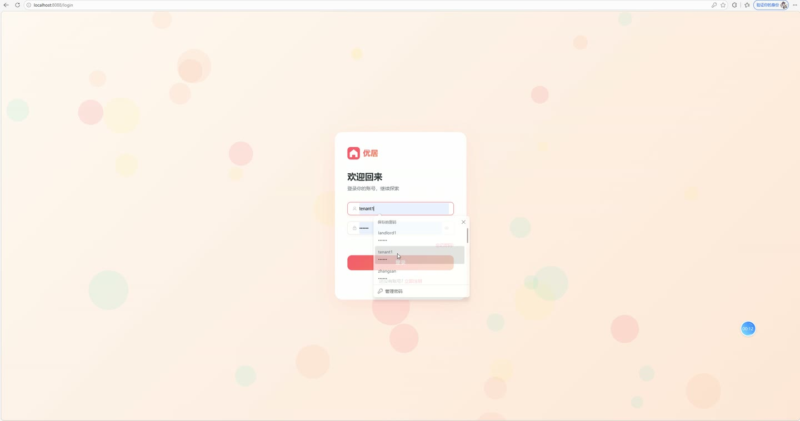
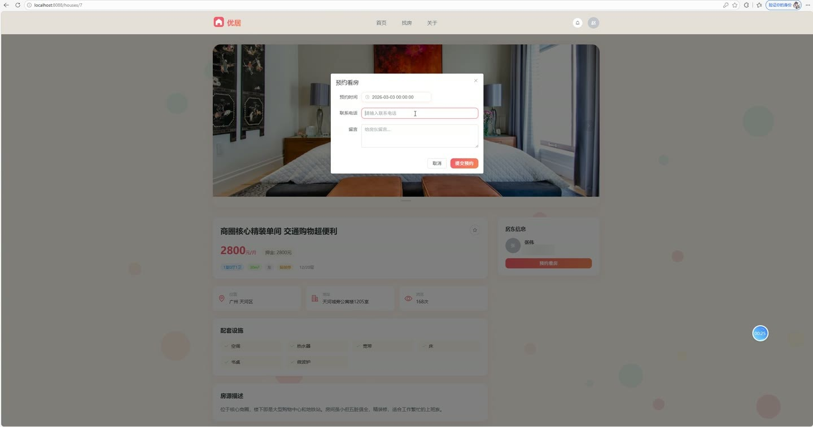
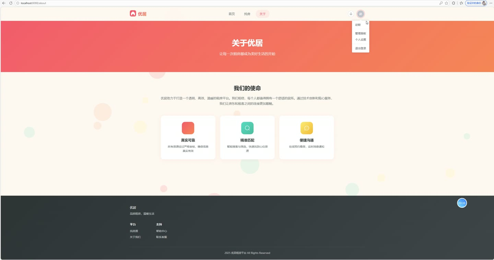
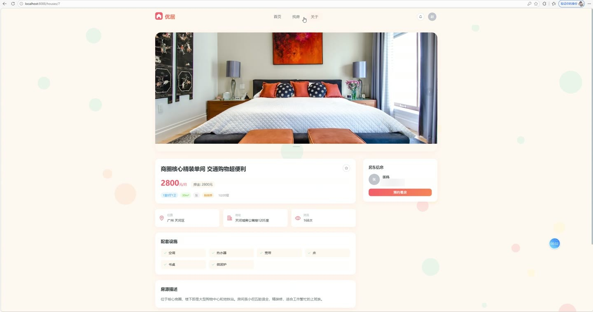
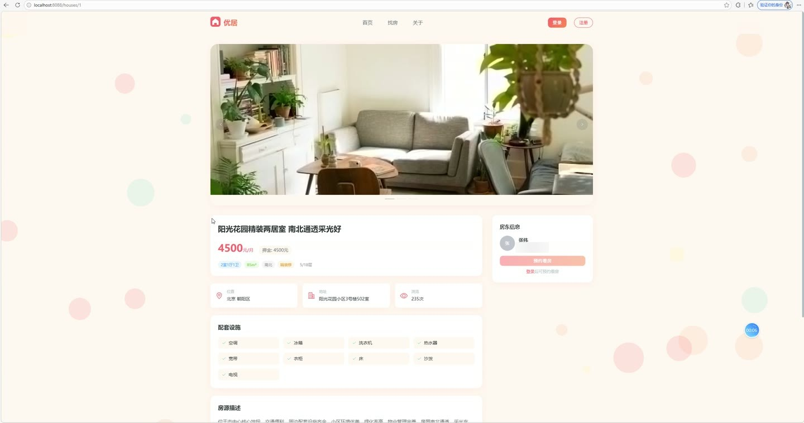

# (附文档)Springboot3+Vue3+MySQL 租房网站

**技术栈**：Springboot3、Vue3、MySQL

### 系统简介

本系统是一套基于 SpringBoot3 + Vue3 的前后端分离租房平台，包含普通用户端、房东端、管理员端三个角色。普通用户可浏览房源、收藏、预约看房；房东可发布房源、处理预约；管理员负责用户、房源、公告的审核与管理。系统内置 JWT 身份认证、RBAC 权限控制、文件上传、站内消息通知、数据统计图表等完整功能。
 
### 核心功能
 
### 普通用户端

 
- 用户注册：填写用户名、密码、手机号、邮箱等信息完成注册，默认角色为租客（TENANT） 
- 用户登录：支持用户名/密码登录，登录成功后返回 JWT Token 并记录最近登录时间、累计登录次数 
- 密码找回：输入注册邮箱生成重置 Token，通过 Token 在有效期内（1小时）重置密码 
- 房源浏览：支持关键词（标题/描述/地址）、城市、区域、价格区间、户型筛选，按最新/价格升序/价格降序/浏览量排序 
- 房源详情：查看房源图片、房东姓名与联系电话、房屋面积/楼层/朝向/装修/配套设施，自动累计浏览量 
- 收藏房源：对感兴趣房源点击收藏/取消收藏，收藏列表分页展示 
- 预约看房：选择看房时间、填写联系电话与留言，提交后自动通知房东，可查看预约状态（待确认/已确认/已拒绝）及房东回复 
- 个人中心：修改头像（上传图片）、更新真实姓名/手机号/邮箱等资料、修改登录密码（需验证原密码） 
- 消息通知：接收系统通知（预约确认/拒绝等），支持标记单条已读、全部已读、查看未读数量
 
### 房东端

 
- 发布房源：填写标题、描述、价格、押金、城市/区域/详细地址、户型、面积、楼层、朝向、装修、配套设施、封面图，上传多张房源图片，提交后状态为待审核 
- 房源管理：查看我发布的房源列表，按状态筛选（待审核/已上架/已下架/已出租），支持编辑房源信息与图片、删除房源 
- 编辑房源：修改房源全部字段，重新上传图片列表（覆盖原图），更新后保留原状态 
- 预约处理：查看租客的看房预约列表（含租客姓名、房源标题、预约时间、联系电话、留言），确认或拒绝预约并填写回复内容，系统自动通知租客 
- 图片上传：支持上传房源图片与头像，返回可访问的图片 URL
 
### 管理员端

 
- 数据统计：查看总用户数、房东数量、租客数量、房源总数、已上架/待审核/已出租房源数，房源城市分布饼图与状态柱状图 
- 用户管理：分页查询用户列表，支持按用户名/姓名/手机号关键词搜索、按角色筛选，启用/禁用用户账号、删除用户 
- 房源管理：分页查看全部房源，支持按标题关键词、状态筛选，修改房源状态（上架/下架/审核通过/标记出租） 
- 公告管理：发布公告（标题、内容、状态），编辑公告内容与上下架，删除公告，前台展示最新10条已发布公告
 
### 技术栈

 后端框架Spring Boot 3.x ORMMyBatis-Plus（含分页插件、逻辑删除、自动填充） 权限认证Spring Security + JWT（jjwt 0.12.x） 前端框架Vue 3（Composition API + script setup） 状态管理Vue Router（路由守卫控制访问权限） UI 组件库Element Plus 图表库ECharts 构建工具Vite 数据库MySQL 8.x 密码加密BCryptPasswordEncoder 文件上传本地存储（UUID 重命名，支持 10MB 单文件）
 
### 交付内容

 
- 后端完整源码 
- 前端完整源码 
- 数据库初始化脚本 
- 万字文档

## 界面展示

---

## 获取完整源码 + 万字文档

本仓库为项目介绍页。**完整前后端源码、数据库初始化脚本、万字项目文档**，请加微信 `kangkangcode`，或访问 [codekk.top](http://codekk.top) 获取。

可作课程设计 / 毕业设计参考，支持远程部署调试。